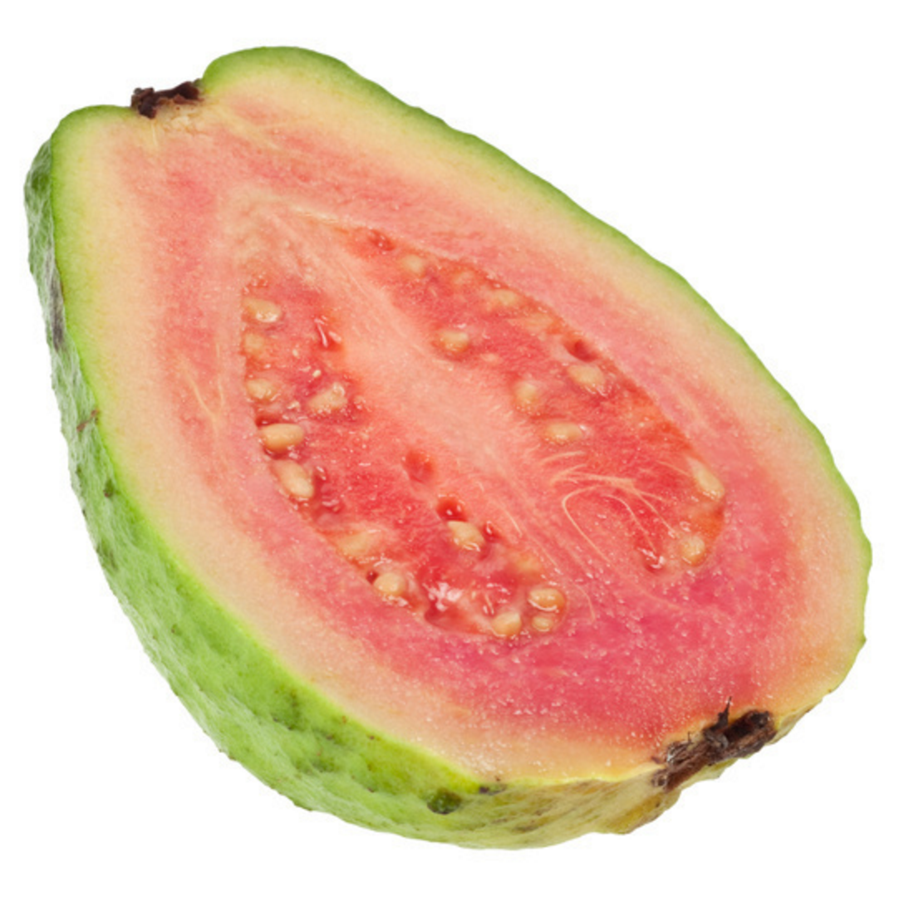

I am the other index.

When juicer runs, it should update the relative paths, but not the absolute ones.

## things with href

- absolute: <a href="http://mango.com">mango.com</a>
- protocol-relative: <a href="//coconut-cdn.com">coconut-cdn.com</a>
- relative: <a href="papayas">papayas</a>
- relative with leading slash: <a href="/grapes">grapes</a>

## things with src

- absolute: 
- protocol-relative: 
- relative: 
- script, too: <script src="banana.js">
